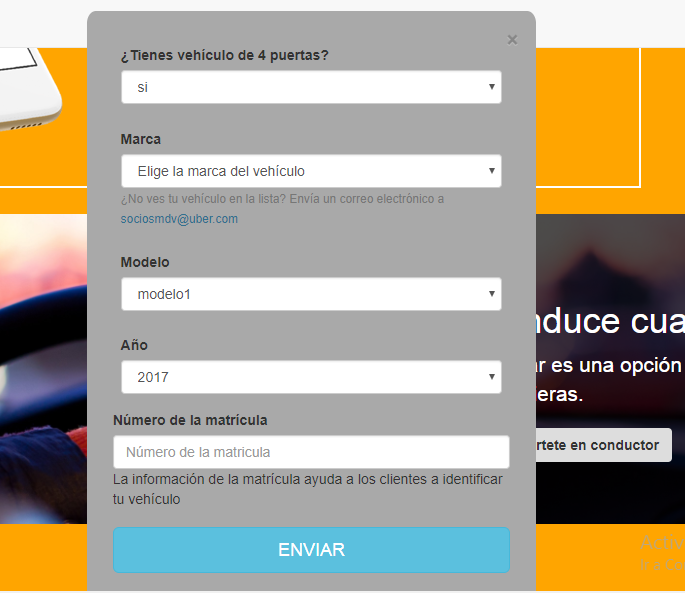

# __LAB-<AR__

Reto asignado por Laboratoria que consiste en recrear la siguiente página web. 

Utilizando el framework **__Bootstrap__**.

Donde las imágenes y todo lo que necesitaremos lo encuentraremos en un pagina  de github , donde se necesitara hacer un [**fork**](https://github.com/Laboratoria-learning/lab-car-boilerplate) del repositorio y clonarlo en tu máquina.

* ### __1. La versión web__

* ### __2. La versión Movil__

* ### __3. Modales__

Como extra puedes añadir los modales necesarios en la versión web

Modal de Inicia Sesión modal-sesion

Modal de Regístrate modal-sesion

Modal de Convierte en conductor 

## __Contenido__

Este proyecto contiene:

1. Una carpeta `assets` donde se encuentra la carpeta `images` donde se encuentran las imagenes empleadas en el proyecto.

2. Una carpeta `css` donde se encuentra el archivo `main.css` donde se encuentran las clases de nuestro html.

3. Una carpeta `js` donde se encuentra la carpeta `app.js` donde se encuentran nuestro codigo javaScript.

4. Una carpeta `vendors` donde se encuentra las carpetas `bootstrap-3.3.7-dist`, donde se las carpetas y archivos necesarios del framework bootsrap, y la carpeta `js` donde se encontrara los archivos de jQuery necesarios.

5. un archivo `index.html` donde se encuentra nuestra estructura y se vera la visualización de la pagina.

6. Un archivo  **`README.md`** que explica el contenido del repositorio.

## __Autoras__

* Nataly Ortiz.
* Kattia Rojas Arohuanca.
